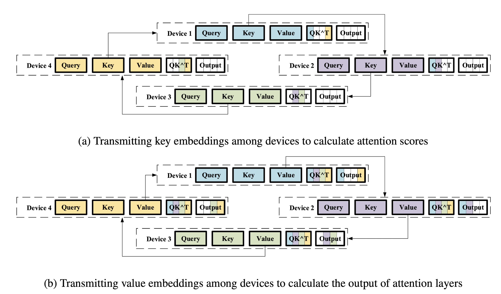

# Sequence Parallel Linear Attention

Transformer-based language models, such as BERT and GPT, have made significant advances in the field of natural language processing. **A core component of the Transformer architecture is the self-attention layer, which grows quadratically in computation and memory cost with respect to the sequence length, limiting its ability to handle long sequences**. To solve this issue, linear complexity Transformers reduce the computational and memory costs while quadratic attention methods like Sequence Parallelism which handle longer sequences by distributing an individual sequence into different machines. **This work combines two linear complexity Transormers, *Linformer* and *Big Bird*, with Sequence Parallelism, allowing longer sequences to be handled than was previously possible.** Experiments show that our implementation of *Linformer* with Sequence Parallelism can handle 3x the maximum batch size and 11x the maximum sequence length when scaling up to 32 NVIDIA P100 GPUs, compared to the original Sequence Parallelism. Our implementation of *Big Bird* can handle around 1.5x the maximum batch size and 3x the maximum sequence length. Moreover, these efficiency gains grow as we increase the sequence length, and both models provide either higher or comparable throughput.

## Algorithm Details

### Sequence Parallelism

Sequence Parallelism is a method where the input sequences are individually split into multiple chunks, and the chunks are distributed to different machines. *It splits each training example* instead of splitting a minibatch of examples or splitting the parameters/layers of the model. Thus, it is a new mode of parallelism which can allow handling longer sequences than previously possible, and should provide linear scaling in terms of memory consumption (since each example is equally broken down and distributed to devices). Distributing the input chunks across machines ensures that the costs for the full-attention operation in any one machine are not too high.

  

*Ring Self-Attention (RSA)* is the main idea behind distributing the attention computation across machines. Consider that the input distribution is in the form of `Q = {Q1, Q2, ..., QN}`, `K = {K1, K2, ..., KN}`, such that `Qi`, `Ki` are the query, key embeddings distributed to machine `i`. The target is to calculate `Ai = Qi * K^T` for each machine — the entire `K` matrix is needed for computing a subset of the attention. Since other devices’ chunks of K are not available to the machine, they are communicated in a ring-style fashion similar to ring all-reduce — after the first round of communication, `Ki` has been communicated to machine `(i + 1)`, after the second round `Ki` has been communicated to machine `(i + 2)`, and so on. In `(N − 1)` rounds of communication the entire `K` matrix is communicated to all machines and the attention matrix `Ai` can be communicated.

  

### *Linformer* with Sequence Parallelism

  

*Linformer* is a linear complexity Transformer that drastically reduces the complexity of the attention computation. Central to *Linformer*’s idea is that the self-attention matrix is low rank, which means there exists a matrix of lower dimensions than can effectively approximate the full-attention matrix. *Linformer* adds two linear projection matrices when computing the key and value. These projections are used to project the original `(n × d)`-dimensional key and value matrices to `(k × d)`-dimensional projections. The `(n × d)` query matrix is then used to first compute an `(n × k)` attention matrix, and then an `(n × d)` output matrix.

  

Our implementation of *Linformer* takes in key-value chunks like the original Sequence Parallelism. It then uses a linear layer to project the key-value chunks into smaller diimensions. These projection matrices are separately initialized in each machine using the same initialization function, rather than initializing it on one machine and scattering, thereby saving some communication costs. Our implementation also provides the option of sharing projection matrices across attention heads (instead of initializing a different matrix for each head), which can allow further reduction of the model parameters. In the forward-pass implementation, the individual key-value chunks are projected into lower dimension matrices. Following this, the model performs an all-reduce to sum the the individual key projections. The model then performs an all-reduce to sum the individual value projections.
Once the summed key projection and value projection is obtained, the standard attention computation helps calculate the output. We use all-reduce operations instead of the ring-communication in Sequence Parallelism because it can use internal PyTorch optimizations for collective communication while not using any extra memory.

### *Big Bird* with Sequence Parallelism

  

*Big Bird* is a sparse attention mechanism that reduces the quadratic complexity of Transformers to linear complexity, thereby enabling scaling up to longer sequences and performing well on many tasks requiring long contexts. Central to Big Bird’s novelty is graph sparsification, which refers to the idea that intelligently constructed sparse graphs can approximate the connections in a complete graph well. By using insights from random graphs modelling the complete graph, locality of reference and the importance of global tokens, the authors reduce the computations involved in attention calculation from quadratic to linear, while satisfying the theoretical properties of a full Transformer. As seen in the figure above, only parts of the attention matrix are calculated, reducing memory consumption.

  

Integrating *Big Bird* with Sequence Parallelism involved some changes to the original algorithm, but the crux of Sequence Parallelism stayed the same. The point till which the devices receive the query, key and value blocks remain the same in both implementations. Before any communication, each device computes the slid- ing window/random attention part which can be locally computed. If the device contains the first or last query blocks, it also computes part of the global attention blocks. The key blocks from each device are then communicated to each other in ring-style communication. We stick to ring-style communication, instead of performing an all-gather, because that would make the first and last devices hold the entire key matrix which increases memory consumption significantly. During ring-communication, each key chunk received is used to calculate any possible (and remaining) sliding window, random and global attention blocks. 

*Big Bird* also uses random attention, where each query block is randomly mapped to some key blocks to contribute to attention computation. This random mapping must be the same in each machine, and change across each minibatch. We generate a random mapping tensor and broadcast it to each device during data batch generation. It must also be noted that while Big Bird uses the gather operation to collect random attention key blocks, it is not possible in our implementation because the key blocks might be on a different device. As a result, during each round of the ring-communication we check if the received key blocks are applicable for random attention, and perform computations if needed.

## Results

### Linear Attention with Sequence Parallelism consumes less memory, and scales linearly

  
  

### Linear Attention with Sequence Parallelism helps achieve higher batch sizes and sequence lengths

  
  

